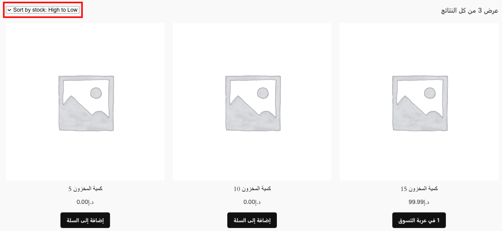

# ترتيب المنتجات حسب المخزون

إضافة لـ WordPress تتيح ترتيب منتجات WooCommerce حسب كمية المخزون المتوفرة.

## الوصف

تضيف هذه الإضافة خيارات ترتيب جديدة لصفحة المتجر في WooCommerce تسمح للعملاء بترتيب المنتجات حسب كمية المخزون المتوفرة. يمكن ترتيب المنتجات تصاعدياً أو تنازلياً.

## المميزات

- إضافة خيارين جديدين لترتيب المنتجات في WooCommerce:
  - "ترتيب حسب المخزون: من الأعلى للأقل" - يعرض المنتجات ذات المخزون الأعلى أولاً
  - "ترتيب حسب المخزون: من الأقل للأعلى" - يعرض المنتجات ذات المخزون الأقل أولاً
- تتكامل بسلاسة مع خيارات الترتيب الموجودة في WooCommerce
- خيارات الترتيب الجديدة تظهر دائماً في نهاية قائمة خيارات الترتيب

## لقطة شاشة

## المتطلبات

- WordPress 5.0 أو أحدث
- WooCommerce 3.0 أو أحدث
- PHP 7.2 أو أحدث

## التثبيت

1. قم بتحميل ملف الإضافة المضغوط
2. انتقل إلى لوحة تحكم WordPress وقم بزيارة الإضافات ← إضافة جديدة
3. انقر على زر "رفع إضافة" في الأعلى
4. قم برفع الملف المضغوط والنقر على "تثبيت الآن"
5. بعد التثبيت، انقر على "تفعيل"

## الاستخدام

بمجرد التفعيل، تضيف الإضافة تلقائياً خيارين جديدين لصفحة المتجر. يمكن للعملاء اختيار:
- "ترتيب حسب المخزون: من الأعلى للأقل" لرؤية المنتجات ذات المخزون الأعلى أولاً
- "ترتيب حسب المخزون: من الأقل للأعلى" لرؤية المنتجات ذات المخزون الأقل أولاً

## المطور

- [Mohamed Yussry](https://github.com/mohamedyussry)

## الترخيص

هذا المشروع مرخص تحت GPL v2 أو أحدث
